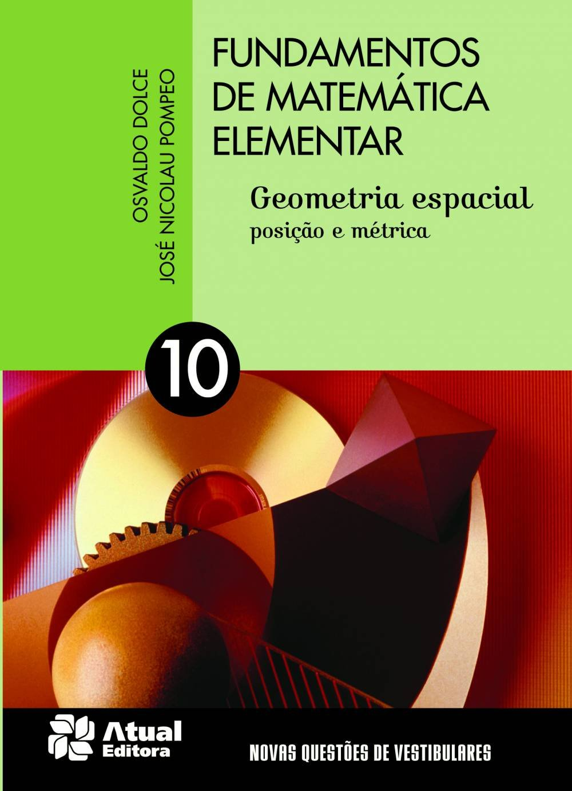

# Geometria-Plana-Geometria Espacial - Posição e Métrica
_"Osvaldo Doce, José Nicolau Pompeo"_  
++++++++++++++++++++++++++++++++++++++++++++++++++++++++++++++++++++++++++++++++++++++++++++++++++++++++++++  
         
++++++++++++++++++++++++++++++++++++++++++++++++++++++++++++++++++++++++++++++++++++++++++++++++++++++++++++  

```python
class Chapter01:
    exercises = []
    topics = [
        "CAPÍTULO I — Introdução",
        "I. Conceitos primitivos e postulados",
        "II. Determinação de plano",
        "III. Posições das retas",
        "IV. Interseção de planos",
    ]
```
